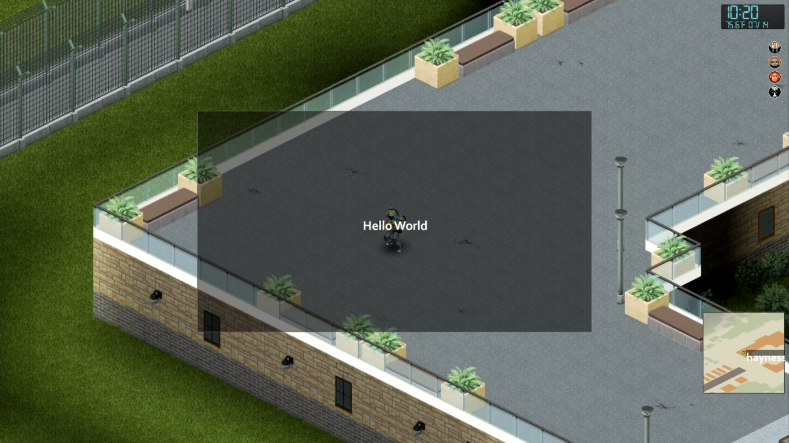

# Project Zomboid Mod: Hello World



## How to use

1. [Download Project Zomboid](https://store.steampowered.com/app/108600/Project_Zomboid/)
2. Open Terminal to clone repo in correct folder:
    * ```cd %userprofile%/Zomboid/mods```
    * ```git clone https://github.com/hayleyw7/PZHelloWorld.git```
3. Open Project Zomboid through Steam debug mode
4. Install mod on server: 
    * "Host" > "Manage Settings" > "Edit Selected Settings" > "Mods"
    * "Add an installed mod to the list" > "Hello World"
    * Save > Start
5. Run mod:
    * After character spawn, press ``` ` ``` to open game command console
    * Type `HelloTable.openPanel()` + Enter to open
    * Type `HelloTable.closePanel()` + Enter to close

## Special thanks & credit

Special thanks & credit to [Zendachi](https://github.com/zendachi) (AKA Burryaga) for teaching me how to create this. Check out [Burryaga's Project Zomboid Mods](https://steamcommunity.com/id/zendachi/myworkshopfiles/?appid=108600)!
