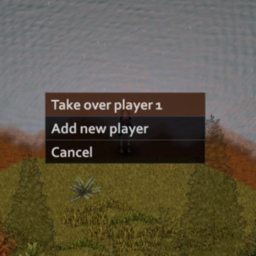

# Project Zomboid Mod: Gamepad Switch Confirmation



## What it does

This mod **does not add a new popup**.  
Project Zomboid already shows a confirmation popup every time you switch to a controller.

What this mod does:
- **Centers** the existing popup window on the screen
- **Fixes text clipping** when using large fonts (so the message is fully readable)

It’s a small accessibility and polish mod for controller users who use larger font sizes or want cleaner UI behavior.

## How to install

1. [Download Project Zomboid](https://store.steampowered.com/app/108600/Project_Zomboid/)
2. Open Terminal and navigate to your mods folder:
   ```sh
   cd %userprofile%/Zomboid/mods
